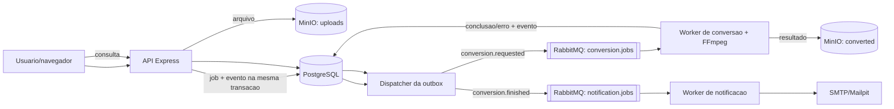

# Arquitetura do conversor distribuído

## Objetivo

O sistema recebe arquivos de audio e video, converte-os de forma assincrona e notifica o usuario por e-mail. A API apenas aceita o pedido; o trabalho pesado e executado por workers que podem ser escalados horizontalmente.

## Componentes

| Componente | Responsabilidade |
| --- | --- |
| API Express | valida upload, cria job e expoe consulta de status. |
| PostgreSQL | fonte de verdade dos jobs, eventos da outbox e notificacoes. |
| MinIO | armazena a origem em `uploads` e o resultado em `converted`. |
| RabbitMQ | entrega mensagens persistentes, retries por TTL e filas DLQ. |
| Dispatcher | publica eventos pendentes da outbox apos confirmacao do broker. |
| Worker de conversao | reivindica o job, executa FFmpeg e persiste o resultado. |
| Worker de notificacao | envia a mensagem de conclusao ou erro, com retries. |

## Estado persistido

`jobs` possui os estados `PENDENTE`, `PROCESSANDO`, `CONCLUÍDO` e `ERRO`. O job em processamento possui token e lease. `outbox_events` registra `PENDING`, `PUBLISHING` ou `PUBLISHED`; um evento e unico por `(job_id, event_type)`. `notifications` registra `PENDING`, `SENDING`, `SENT` ou `FAILED`.

O upload no MinIO ocorre antes da transacao. Dentro dela, job e evento `conversion.requested` sao gravados juntos. Em caso de falha da transacao, a origem enviada e removida. Ao terminar ou falhar, o worker atualiza o job e grava `conversion.finished` na mesma transacao.

## Decisoes e limites

- O broker oferece entrega ao menos uma vez; nao ha promessa de exatamente uma vez ponta a ponta.
- A idempotencia da conversao e obtida por token/lease no banco e pela verificacao do objeto de resultado antes de reconverter.
- URLs de origem e download sao assinadas. A URL de origem possui prazo maximo configurado de sete dias; a URL de download e criada na consulta de status.
- A composicao e voltada ao ambiente local. Credenciais padrao e servicos expostos nao devem ser usados como configuracao de producao.
- O sistema nao persiste qual replica executou um job. O benchmark verifica consumidores e resultados, nao afinidade entre job e container.
