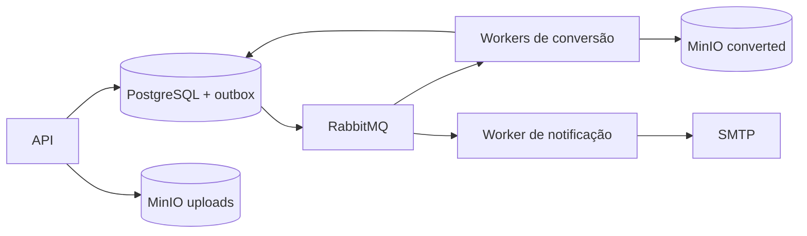

# Relatório de entrega - Conversor de arquivos distribuídos

## Problema e solução

Conversões de mídia podem demorar e falhar por indisponibilidades temporárias. Quando a própria requisição HTTP tenta executar todo o trabalho, a pessoa fica esperando, uma queda pode deixar o pedido sem resposta e reenvios podem causar processamento ou notificações duplicados.

A solução separa o recebimento do arquivo do processamento. A API salva a origem no MinIO, grava o job e o evento inicial em uma transação PostgreSQL; um dispatcher publica o evento no RabbitMQ. Workers independentes processam a conversão com FFmpeg e um worker separado notifica o usuário por e-mail.

## Arquitetura e fluxo

A outbox evita a lacuna entre criar o job e publicar a mensagem. O dispatcher reivindica eventos com lease, publica mensagens persistentes e espera confirmação do broker. A consulta de status retorna uma URL de download apenas para jobs concluídos.

## Confiabilidade

Cada job é reivindicado com token e lease de 120 segundos, renovado a cada 30 segundos. Assim, duas réplicas não devem processar simultaneamente o mesmo job. O resultado tem chave determinística por job; se já existir numa reentrega, o worker finaliza sem reconverter. As filas de retry usam 5 e 30 segundos; após três falhas, as mensagens seguem para DLQ. A entrega é ao menos uma vez, portanto não se promete exatamente uma vez ponta a ponta.

## Benchmark real

Foram enviados dois lotes idênticos: oito WAVs de 30 segundos, primeiro com uma réplica e depois com duas. O tempo mede do primeiro envio até todos os jobs concluídos.

| Workers | Tempo do lote | Vazão | Variação |
| --- | ---: | ---: | ---: |
| 1 | 5,994 s | 1,335 jobs/s | referência |
| 2 | 3,509 s | 2,280 jobs/s | +71% |

Os dois lotes criaram 16 jobs, cada um com resultado distinto e uma tentativa. A fila apresentou um consumidor na primeira rodada e dois na segunda. O ganho não chega a 100% porque upload, banco, broker, armazenamento e consulta de status também participam da medição.

## Limites e demonstração

O ambiente é local e não implementa autenticação, cancelamento nem retenção automática de objetos/DLQs. O roteiro completo está em `roteiro-demonstracao.md`; a explicação acessível do benchmark está em `benchmark-explicacao.md`.
