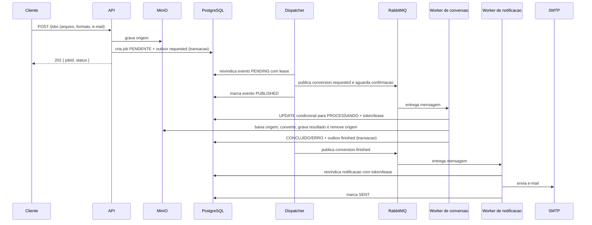

# Sequencia de processamento

## Falhas e reentregas

O worker de conversao usa `prefetch(1)`. A reivindicacao do job e um `UPDATE` condicional: apenas um worker recebe o token valido. O lease dura 120 segundos e o heartbeat tenta renova-lo a cada 30 segundos. Se a posse e perdida, o worker nao conclui o job e a mensagem volta para retry de 30 segundos.

Falhas comuns de conversao liberam o job para `PENDENTE` e enviam a mensagem para retry de 5 segundos na primeira tentativa ou 30 segundos na segunda. Na terceira falha, o job recebe `ERRO`, um evento final e a mensagem vai para `conversion.dlq`. A notificacao segue tres tentativas e, no esgotamento, fica `FAILED` e vai para `notification.dlq`.

As filas de retry sao duraveis e usam TTL com dead-letter de volta para a fila principal. Antes de reconhecer uma mensagem reenviada, o worker publica a nova mensagem com confirmacao do RabbitMQ.
